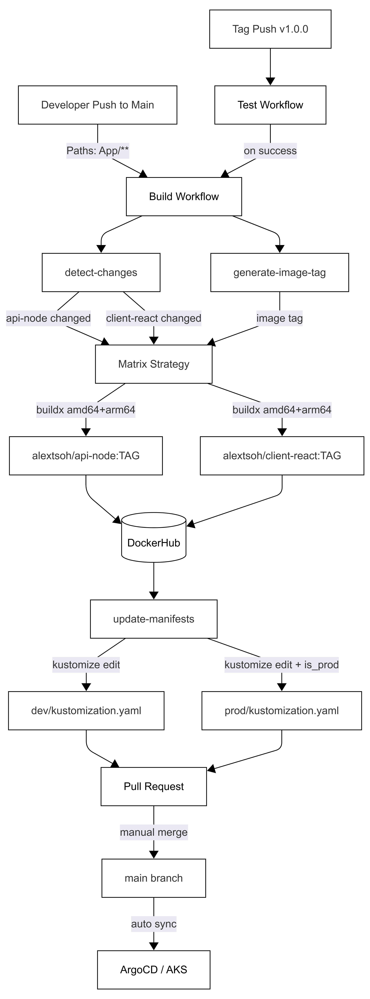

# CI/CD Pipeline
## Overview

This repository uses GitHub Actions workflows to automate testing, building, and deploying container images via Kustomize overlays and spin up a AKS cluster via terraform.

---

## Workflows

### 1. Test Workflow (`test.yml`)

Triggers on tag push `v*.*.*`. Runs `api-test` and `client-test` jobs in parallel — lint, tests, and build validation. Blocks `image-ci` via `workflow_run` on failure.

---

### 2. Build and Push (`build.yml`)

Triggered by:
- `push` to `main` with changes in `App/api-node/**` or `App/client-react/**` — runs immediately, no tests required
- `workflow_run` from Test Workflow completing successfully — triggered by tag pushes

**Jobs:**

#### `detect-changes`
Uses `dorny/paths-filter` to determine which services changed. Outputs boolean flags for `api-node` and `client-react`. On tag pushes, both services are always built regardless of file changes.

#### `generate-image-tag`
Generates an image tag based on the Git ref:
- **Tag push** → uses `github.ref_name` directly (e.g. `1.2.3`)
- **Branch push** → uses `git describe --tags --long` (e.g. `1.2.2-4-gabcdef1`)

#### `build-and-push`
Runs as a matrix strategy across `api-node` and `client-react`. Each matrix leg:
- Builds a multi-platform image (`linux/amd64`, `linux/arm64`) using Docker Buildx
- Uses GitHub Actions cache (`type=gha`) for Docker layer caching
- Pushes to DockerHub under `alextsoh/<service>:<tag>`
- Skips entirely if `should_run` is false for that service

#### `update-manifests`
Runs after a successful build. Uses Kustomize to patch image tags in the GitOps manifests:
- Always updates `App/k8s/kustomize/dev/kustomization.yaml`
- On tag push (`is_prod=true`), also updates `App/k8s/kustomize/prod/kustomization.yaml`

Opens a pull request via `peter-evans/create-pull-request` targeting `main` with the updated manifests.

---

Database Migration Secret Management:

The db-migrator Job in production retrieves the database connection URL directly from Azure Key Vault via the Secrets Store CSI Driver. The CSI volume mounts the secret from Key Vault into the pod using Azure Workload Identity for authentication, and simultaneously syncs it to a Kubernetes secret (`my-app-secrets-sync`), from which the `DATABASE_URL` environment variable is sourced. The `secretProviderClass` reference in the migrator patch was updated to use the kustomize-prefixed name (`prod-my-app-secrets`) to match the rendered resource name in the prod overlay.

---

Secret Delivery: File Mount and K8s Secret Sync:

Both the API and migrator retrieve the database URL from Azure Key Vault via the Secrets Store CSI Driver, but they consume it differently.

The API uses a file mount — the CSI driver writes the secret directly to /mnt/secrets/database-password inside the pod. The app reads it with fs.readFileSync() via the DATABASE_URL_FILE env var. The value never touches etcd and is not accessible via kubectl get secret.

The migrator uses secretObjects — the CSI driver syncs the Key Vault value into a Kubernetes Secret (my-app-secrets-sync), which the pod then reads via secretKeyRef. This is simpler since the migrate CLI only accepts a connection string directly, but the K8s Secret persists in etcd after the Job completes and can be read by anyone with kubectl get secret RBAC access.

---
ArgoCD Identity-Based Access:

The ArgoCD authentication flow is initiated via OIDC through a kubectl port-forward tunnel at http://localhost:8080
The argocd-server pod uses Azure Workload Identity. It projects a Kubernetes ServiceAccount token that is validated against the AKS OIDC Issuer URL via a Federated Credential trust relationship. 
Authorization is handled by the argocd-rbac-cm, which maps Entra ID groups to internal ArgoCD roles for an identity-based permission model.